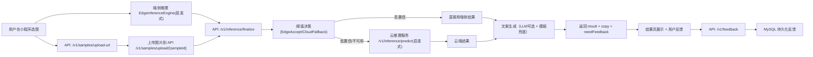

# Meowlator 项目说明书（面试版 + 小白版）

> 版本基线：`1.0.0`  
> 适用仓库：`/Users/dysania/program/meowlator`  
> 目标读者：第一次接触该项目的人、面试讲解场景

---

## 1. 项目一句话

**Meowlator 是一个“猫语翻译”小程序系统：优先端侧推理，置信度不够就走云端复判，并收集用户反馈做后续训练迭代。**

注意：当前代码里，端侧和云端推理都还是**启发式/模拟实现**，不是线上可用的真实 ONNX 推理引擎。

---

## 2. 这个项目在解决什么问题

普通用户拍一张猫咪图片，希望快速得到：

1. 猫当前最可能的意图（Top3）
2. 三维状态（紧张/兴奋/舒适）
3. 一段可分享的“猫语文案”
4. 低置信场景下可回收反馈，支持后续模型改进

同时要满足工程要求：

1. 有鉴权和会话
2. 有限流和白名单控制
3. 有灰度发布与回滚能力
4. 有训练、评估、门禁脚本

---

## 3. 技术栈与目录

### 3.1 技术栈

- 客户端：微信小程序 + TypeScript
- API：Go（标准库 HTTP）
- 云推理服务：Go（独立 service）
- 训练：Python + PyTorch + torchvision
- 数据库：MySQL
- 缓存：Redis（可选）
- 部署：Docker Compose（本地/演示）
- CI：GitHub Actions（Go + Python）

### 3.2 目录结构

- `apps/wechat-miniprogram`：小程序端
- `services/api`：网关 + 业务编排
- `services/inference`：云端推理服务
- `ml/training`：训练与数据流水线脚本
- `infra/migrations`：MySQL 表结构迁移
- `docs`：接口、SOP、实现节点文档

---

## 4. 架构总览（从用户点击到拿结果）



---

## 5. 核心流程详细拆解

### 5.1 登录与会话

1. 小程序先调用 `POST /v1/auth/wechat/login`
2. 服务端返回 `userId + sessionToken + expiresAt`
3. 后续受保护接口都要带：
   - `Authorization: Bearer <sessionToken>`
   - `X-User-Id: <userId>`

说明：当前 `userId` 是由 `code` 计算得到的稳定 ID（演示实现），不是完整微信 openid 流程。

### 5.2 上传与签名

1. 小程序请求 `POST /v1/samples/upload-url`
2. 该接口要求请求签名：
   - `X-Req-Ts`
   - `X-Req-Sig`
3. 签名算法：`FNV32(method|path|ts|body|sessionToken)`
4. 服务端校验时间偏差（默认 5 分钟）和签名一致性
5. 图片通过 `POST /v1/samples/upload/{sampleId}` 上传

### 5.3 端云融合推理

1. 小程序先做端侧推理，得到：
   - `edgeResult`
   - `edgeRuntime`（模型版本、耗时、设备、失败码等）
2. 调用 `POST /v1/inference/finalize`
3. API 根据阈值决策：
   - `edgeConfidence >= edgeAccept`：直接用端侧
   - `edgeConfidence < cloudFallback`：走云端 + 强制反馈
   - 中间区间：走云端
   - 设备不支持或端侧失败：走云端 + 强制反馈
4. 返回最终 `result + copy + needFeedback + fallbackUsed`

### 5.4 反馈回收

1. 结果页支持“正确/错误”反馈
2. 错误反馈必须带 `trueLabel`
3. 服务端写入 `feedback`，并计算：
   - `training_weight`（正确=0.6，纠错=1.0）
   - `reliability_score`（基于用户历史行为）

---

## 6. 各模块真实实现（当前代码状态）

## 6.1 小程序端（`apps/wechat-miniprogram`）

职责：

1. 处理登录会话
2. 本地“端推理”
3. 上传图片
4. 调 API 完成融合推理
5. 展示结果并提交反馈

关键点：

1. `utils/edge_inference.ts` 是哈希驱动的启发式结果生成器，不是 ONNX Runtime。
2. 支持设备白名单判断，不在白名单直接标记 `DEVICE_NOT_WHITELISTED`，让服务端走云端。
3. `utils/api.ts` 自动补齐鉴权头和请求签名头。

## 6.2 API 服务（`services/api`）

职责：

1. 鉴权、签名校验、限流、白名单、配额控制
2. 样本创建与上传流程
3. 端云融合推理编排
4. 文案生成（LLM 可选）
5. 反馈入库、清理任务、模型灰度管理

关键能力：

1. 会话：`user_sessions` 表 + Bearer token 校验
2. 限流：内存 minute window（按 user + ip）
3. 白名单：可开关，支持每日配额
4. 灰度：`model_registry` 里支持 `ACTIVE/GRAY/CANDIDATE/...`，按桶路由
5. 风险分支：`PAIN_RISK_ENABLED=true` 时输出风险提示（非医疗）

## 6.3 云推理服务（`services/inference`）

职责：

1. 接收 `imageKey + sceneTag`
2. 返回意图 Top3 + 状态 + 置信度 + 证据

当前实现：

1. 采用哈希 + 先验融合（`priorBlendWeight=0.20`）的确定性算法。
2. 可加载 `intent_priors.json`（只影响分布先验）。
3. **没有加载 ONNX，也没有真实图像特征提取。**

## 6.4 训练与数据流水线（`ml/training/scripts`）

有两条线：

1. 视觉训练线（`train.py`）  
   - 模型：`torchvision.models.mobilenet_v3_small`
   - 输出：checkpoint、metrics、intent_priors、confusion_matrix、calibration
2. 数据工程线  
   - 清洗：`data_cleaning.py`
   - 合并清单：`build_training_manifest.py`
   - 主动学习任务：`generate_active_learning_tasks.py`（40/40/20）
   - 评估：`evaluate_intent_metrics.py`
   - 阈值报告：`threshold_report.py`
   - 发版门禁：`gate_model_release.py`
   - ONNX 导出：`export_onnx.py`

---

## 7. 你最关心的问题（逐条回答）

## 7.1 本地测试 vs 正式部署

### 本地测试（开发态）

1. 启服务：
   ```bash
   make up
   ```
2. 运行测试：
   ```bash
   make test
   ```
3. 训练与评估（按需）：
   ```bash
   make train-vision
   make evaluate-intent
   make gate-model
   ```

说明：

1. 小程序默认请求 `http://127.0.0.1:8080`
2. API 若无 `MYSQL_DSN` 会退化到内存仓储
3. Redis 不可用时只会关闭文案缓存，不影响主流程

### 正式部署（生产态）

建议流程：

1. 先过门禁：`make test` + `gate_report pass=true`
2. 先注册候选模型（admin API）
3. 按 10% -> 30% -> 60% 灰度观察
4. 最后激活正式模型
5. 异常时使用 activate 回滚

必配环境变量（最少）：

1. `MYSQL_DSN`
2. `REDIS_ADDR`
3. `ADMIN_TOKEN`
4. `EDGE_ACCEPT_THRESHOLD` / `CLOUD_FALLBACK_THRESHOLD`
5. `RATE_LIMIT_PER_USER_MIN` / `RATE_LIMIT_PER_IP_MIN`
6. `WHITELIST_*`（如启用白名单）

## 7.2 “端推理和云推理都还是启发式/模拟，不是实际 ONNX 推理”是什么意思

意思是：

1. 代码有训练和导出 ONNX 的能力。
2. 但线上调用链路里，端和云都没有真正加载 ONNX 模型执行图像推理。
3. 当前返回结果来自“哈希 + 规则 + 先验”逻辑，主要用于流程打通和工程验证。

影响：

1. 结果可复现，但不代表真实模型效果。
2. 无法体现真实视觉能力与泛化性能。
3. 可用于 API、埋点、灰度、反馈闭环联调，不适合直接宣称“模型已上线”。

## 7.3 Redis 和 MySQL 的用处

### MySQL（核心业务数据）

存储：

1. 用户、猫、样本、反馈
2. 会话 token（`user_sessions`）
3. 模型注册与状态（`model_registry`）
4. 风险事件（`risk_events`）
5. 训练/评估相关表（迁移已准备）

作用：

1. 持久化业务事实
2. 支撑审计、回放、训练数据回收
3. 支撑灰度发布状态管理

### Redis（性能优化）

当前只用于：

1. 文案生成缓存（`copy:v1:*` key）
2. 降低重复结果下的 LLM/模板生成成本

不用于：

1. 会话存储
2. 限流计数（当前限流在 API 进程内存）

## 7.4 用户反馈后，训练可以实时吗

当前答案：**不能实时更新线上模型参数。**

当前实际是：

1. 反馈实时入库
2. 后台离线脚本清洗、合并、训练、评估、门禁
3. 人工/半自动灰度发布新模型

如果要“近实时”：

1. 小步快跑方案：每小时/每天微批训练 + 自动评估 + 自动灰度
2. 真正实时在线学习方案：高复杂度，不建议 MVP 直接做

建议面试回答：  
“本项目当前是离线训练 + 在线部署切换，反馈是实时采集，不是实时参数更新。这是可控、可审计的工业化方案。”

---

## 8. 训练模型、数据集、识别标准（重点）

## 8.1 训练模型是什么

当前训练脚本里的主模型是：

1. `MobileNetV3-Small`
2. 默认加载 ImageNet 预训练权重（`--pretrained` 默认 true）
3. 输出 8 类意图分类

8 类标签：

1. `FEEDING`
2. `SEEK_ATTENTION`
3. `WANT_PLAY`
4. `WANT_DOOR_OPEN`
5. `DEFENSIVE_ALERT`
6. `RELAX_SLEEP`
7. `CURIOUS_OBSERVE`
8. `UNCERTAIN`

## 8.2 用了什么数据集

训练脚本支持两种：

1. `oxford`（默认）  
   - `Oxford-IIIT Pet`  
   - 用类别 id 通过取模映射到 8 个意图（伪标签）
2. `fake`  
   - `torchvision FakeData`  
   - 用于烟雾测试

反馈数据：

1. 清洗、加权、合并脚本已经有
2. 目前主要用于数据工程与统计
3. 当前 `train.py` 主路径仍以 Oxford 包装数据集为主

## 8.3 识别标准是什么

离线指标：

1. `top1`
2. `top3`
3. `ece`（置信度校准误差）
4. per-class precision/recall/f1
5. low-confidence 子集准确率

发版门禁（`gate_model_release.py`）：

1. `top1` 下降不能超过阈值（默认 0.01）
2. `top3` 下降不能超过阈值（默认 0.01）
3. `ece` 不能恶化过多（默认 0.02）
4. 候选模型至少有一项可观察提升

在线判定标准（端云切换）：

1. `edgeAcceptThreshold`（默认 0.70）
2. `cloudFallbackThreshold`（默认 0.45）
3. 低于 fallback 或设备不支持时触发云端并要求反馈

---

## 9. LLM 接入到底是什么

当前 LLM 只用于“文案生成”，不是视觉推理本身。

接入方式：

1. 环境变量控制：
   - `COPY_LLM_ENABLED=true`
   - `COPY_LLM_ENDPOINT=<你的 LLM HTTP 地址>`
2. API 会把结构化推理结果发给该 endpoint
3. 期待返回：
   - `catLine`
   - `evidence`
   - `shareTitle`
4. 失败时自动回退模板文案，不阻塞主流程

所以“接入了什么 LLM”准确回答是：  
**项目没有写死厂商，采用通用 HTTP endpoint 适配层，实际供应商由部署环境决定。**

---

## 10. 稳定性与安全设计

已落地：

1. 会话鉴权（Bearer + userId 双校验）
2. 请求签名防篡改（关键接口）
3. 每分钟 user/ip 限流
4. 白名单 + 日配额
5. 风险分支明确免责声明（非医疗诊断）
6. 过期数据清理任务（样本 + 会话）

待加强（下一阶段）：

1. 分布式限流（Redis 计数）
2. 更强签名算法（HMAC-SHA256 + nonce）
3. 对象存储代替本地 `/tmp` 上传目录
4. 真实微信身份链路与权限体系

---

## 11. 当前版本最真实的“边界结论”

你在面试里可以直接这样说：

1. 这个项目已经把从小程序到云端、再到反馈与发布的工程链路打通了。
2. 训练脚本和 ONNX 导出脚本都具备，但线上推理仍是启发式模拟。
3. MySQL/Redis/灰度/鉴权/限流/白名单这些工程能力已经具备 MVP 级别。
4. 下一步核心是把端云推理替换为真实 ONNX Runtime，并把反馈训练闭环升级为自动化微批迭代。

---

## 12. 面试讲述模板（可直接背）

## 12.1 30 秒版本

“Meowlator 是一个端云协同的猫行为意图识别系统。小程序先做端推理，低置信度时由 API 编排走云端复判，最后返回意图、状态和可分享文案。系统有会话鉴权、签名、限流、白名单和模型灰度发布能力。当前推理引擎是启发式模拟，训练和 ONNX 导出已具备，下一步是接入真实 ONNX Runtime。”

## 12.2 2 分钟版本

“整体是三层：小程序端、API 编排层、云推理层。端上先跑轻量推理，API 根据阈值决策是否复判，并统一输出结果和反馈标记。数据层用 MySQL 做样本/反馈/会话/模型注册持久化，Redis 做文案缓存。训练侧使用 MobileNetV3-Small，基于 Oxford-IIIT Pet 做伪标签训练，并产出 top1/top3/ece、混淆矩阵和校准报告，通过 gate 脚本做发布门禁。发布上支持候选注册、灰度、激活和回滚。当前最大的技术债是线上仍未切到真实 ONNX 推理。”

## 12.3 面试追问“你做了什么”回答模板

“我主要负责把工程链路做完整：包括会话鉴权、请求签名、限流白名单、端云融合决策、反馈权重计算、灰度发布 API，以及训练评估与 gate 脚本。这样团队可以先验证业务闭环，再替换底层推理引擎。”

---

## 13. 常用命令速查

启动：

```bash
make up
```

测试：

```bash
make test
```

本地跑 API / 推理：

```bash
make run-api
make run-inference
```

训练与导出：

```bash
make train-vision
make export-onnx
```

数据流水线：

```bash
make clean-feedback-data
make build-training-manifest
make active-learning-daily
make build-eval-splits
make threshold-report
make evaluate-intent
make gate-model
```

---

如果你要把这份文档用于面试，建议先重点熟悉第 7、8、9、11、12 章，这几章基本覆盖了“架构设计 + 实现细节 + 真实边界 + 演进路线”的高频问题。

---

## 14. v1.0.0 之后新增与已落地能力（补充）

以下内容已经在代码中落地，不是规划项：

1. **白名单 + 每日配额控制**
   - 白名单开关：`WHITELIST_ENABLED`
   - 白名单用户：`WHITELIST_USERS=user_a,user_b`
   - 每日调用上限：`WHITELIST_DAILY_QUOTA`
   - 作用范围：受保护 API（鉴权后）请求链路

2. **灰度发布“按用户真实生效”**
   - `GET /v1/metrics/client-config` 返回：
     - `modelRollout.activeModel`
     - `modelRollout.rolloutModel`
     - `modelRollout.selectedModel`
     - `modelRollout.inRollout`
     - `modelRollout.userBucket/totalBuckets/targetBucket`
   - 服务端按稳定分桶判断用户是否命中灰度，不再是“只展示不分流”。

3. **小程序接入 selectedModel**
   - 小程序在识别前先拉 `client-config`
   - 将 `selectedModel` 注入 `edgeRuntime.modelVersion` 上报
   - 便于线上按模型版本观察端侧成功率与回退比

4. **设备白名单端侧降级**
   - 若设备不在 `edgeDeviceWhitelist`，端侧不强跑
   - 直接降级云端复判
   - 上报 `failureCode=DEVICE_NOT_WHITELISTED`

5. **实现节点记录机制**
   - 每个迭代节点记录在 `docs/implementation_nodes.md`
   - 使用 `tools/record_node.py` 固化“版本/功能/验证/提交哈希”

---

## 15. 环境变量速查（开发与预发布）

建议复制 `.env.example` 后按需覆盖，以下是常用最小集合：

### 15.1 基础运行

1. `MYSQL_DSN`
2. `REDIS_ADDR`
3. `API_ADDR`（可选，默认本地）
4. `INFERENCE_URL`（API 调云推理地址）

### 15.2 安全与控制

1. `ADMIN_TOKEN`
2. `RATE_LIMIT_PER_USER_MIN`
3. `RATE_LIMIT_PER_IP_MIN`
4. `EDGE_DEVICE_WHITELIST`
5. `WHITELIST_ENABLED`
6. `WHITELIST_USERS`
7. `WHITELIST_DAILY_QUOTA`

### 15.3 推理与业务策略

1. `MODEL_VERSION`
2. `EDGE_ACCEPT_THRESHOLD`
3. `CLOUD_FALLBACK_THRESHOLD`
4. `PAIN_RISK_ENABLED`
5. `MODEL_PRIORS_PATH`（云推理先验文件，可选）

### 15.4 文案服务

1. `COPY_LLM_ENABLED`
2. `COPY_LLM_ENDPOINT`
3. `COPY_TIMEOUT_MS`（API 调用文案服务超时，默认 1200ms）

---

## 16. 从零到可验证（操作手册）

### 16.1 启动服务

```bash
make up
```

检查容器：

```bash
docker compose -f infra/docker-compose.yml ps
```

### 16.2 跑回归

```bash
make test
```

预期：Go API、Go inference、Python 训练脚本单测、小程序 typecheck 全通过。

### 16.3 训练与产物

```bash
make train-vision
make export-onnx
make build-eval-splits
make threshold-report
make evaluate-intent
make gate-model
```

关键产物目录（示例）：

1. `ml/training/artifacts/<model_version>/metrics.json`
2. `ml/training/artifacts/<model_version>/confusion_matrix.json`
3. `ml/training/artifacts/<model_version>/calibration.json`
4. `ml/training/artifacts/pipeline/gate_report.json`

### 16.4 手动验证灰度是否生效

1. 注册候选模型：

```bash
curl -X POST http://127.0.0.1:8080/v1/admin/models/register \
  -H "Content-Type: application/json" \
  -H "X-Admin-Token: ${ADMIN_TOKEN}" \
  -d '{"modelVersion":"mobilenetv3-small-int8-v2","metrics":{"top1":0.63,"top3":0.85}}'
```

2. 设置灰度：

```bash
curl -X POST http://127.0.0.1:8080/v1/admin/models/rollout \
  -H "Content-Type: application/json" \
  -H "X-Admin-Token: ${ADMIN_TOKEN}" \
  -d '{"modelVersion":"mobilenetv3-small-int8-v2","rolloutRatio":0.1,"targetBucket":0}'
```

3. 用不同 `X-User-Id` 拉配置，检查返回的 `modelRollout.inRollout` 与 `selectedModel` 是否变化：

```bash
curl http://127.0.0.1:8080/v1/metrics/client-config \
  -H "Authorization: Bearer <session_token>" \
  -H "X-User-Id: user_a"
```

---

## 17. 常见问题与排查（FAQ）

### 17.1 小程序报“request 合法域名”错误

原因：微信开发工具限制请求域名。  
处理：

1. 开发者工具里勾选“不校验合法域名（仅本地调试）”；或
2. 使用已配置到小程序后台的 HTTPS 域名。

### 17.2 小程序编译报 WXML 语法错误

常见原因：模板中直接写了 JS 表达式（如 `toFixed`）导致解析失败。  
处理：在 JS/TS 里先计算展示字段，再在 WXML 直接渲染。

### 17.3 结果看起来“像随机”

原因：当前端云推理仍是启发式/模拟逻辑。  
处理：这是当前版本设计边界，用于工程链路验证，不代表真实视觉模型效果。

### 17.4 为什么训练两次结果不同

检查项：

1. 是否固定 random seed
2. 是否使用 `--resume-checkpoint`
3. 训练清单是否变化（反馈样本新增会改变分布）
4. 验证/测试切分是否固定

### 17.5 第二次训练是续训还是重训

默认行为取决于命令参数：

1. 传 `--resume-checkpoint`：在上次 checkpoint 基础续训
2. 不传：从预训练权重重新开始

---

## 18. 上线前检查清单（简版）

1. `make test` 全通过
2. `gate_report.json` 为 `pass=true`
3. 白名单用户与配额配置正确
4. `release_sop.md` 灰度步骤已演练（10%/30%/60%/100%）
5. 回滚路径已验证（`/v1/admin/models/activate` 切回旧版本）
6. 过期清理任务可观测（样本与会话）
7. 风险分支若开启，文案包含“非医疗诊断”免责声明
8. 成本周报可见：云兜底占比、LLM命中缓存率、存储增长趋势

---

## 19. 知识点深度说明（工程实战版）

本章是对“高频追问”的展开说明，按统一结构回答：

1. 这件事是什么（定义）
2. 当前项目怎么实现（事实）
3. 这样做的利弊（取舍）
4. 你怎么验证它（可执行）
5. 未来要怎么升级（演进）

### 19.1 本地测试 vs 正式部署

#### 19.1.1 定义差异

1. **本地测试**：目标是“开发联调快”，允许降级与 mock，强调可调试性。  
2. **正式部署**：目标是“稳定服务真实用户”，强调安全、监控、回滚和成本可控。

#### 19.1.2 当前项目事实

本地环境：

1. 使用 `make up` 直接启动 compose 栈。  
2. 小程序默认请求 `http://127.0.0.1:8080`。  
3. 若未设置 `MYSQL_DSN`，API 可回退内存仓储。  
4. Redis 不可用时，文案缓存失效但主链路可跑。  

正式环境（建议）：

1. 必须使用 HTTPS 域名 + 小程序后台合法域名配置。  
2. 必须使用真实 MySQL 持久化，禁止内存仓储兜底。  
3. 开启鉴权、签名、限流、白名单。  
4. 必须可灰度、可回滚、可告警。  

#### 19.1.3 利弊与取舍

本地模式好处：

1. 快速定位问题，迭代速度快。  
2. 依赖不完整时仍可联调。  

本地模式风险：

1. 与线上行为不完全一致（合法域名、真实存储、网络抖动）。  
2. 容易“本地可用，线上失败”。  

#### 19.1.4 如何验证

1. 本地：`make test` 必须全通过。  
2. 预发布：按 `docs/release_sop.md` 跑 10%/30%/60%/100% 灰度演练。  
3. 线上：重点看错误率、`finalize` p95、云兜底比。  

#### 19.1.5 升级建议

1. 增加 staging 环境，配置与生产尽量一致。  
2. 加入合成流量探针（健康检查 + 关键接口链路）。  

---

### 19.2 “端推理和云推理都是启发式/模拟，不是实际 ONNX 推理”是什么意思

#### 19.2.1 定义

1. **启发式/模拟推理**：通过规则、哈希、先验分布生成稳定输出，不真正执行神经网络。  
2. **ONNX 推理**：加载训练后导出的模型图，在 runtime 中做真实张量计算得到预测结果。

#### 19.2.2 当前项目事实

1. 训练链路已支持 `train.py` + `export_onnx.py`。  
2. 线上推理链路（小程序端和 `services/inference`）当前仍是确定性规则实现。  
3. 因此当前结果适合“工程流程验证”，不等于“真实模型效果”。

#### 19.2.3 你可以怎么解释给面试官/业务方

可直接说：

1. “我们先把采集-推理-反馈-发布闭环打通，再替换推理内核，降低项目风险。”  
2. “当前是工程 MVP，不是算法终态。”  

#### 19.2.4 如何验证“是不是 ONNX 真推理”

满足以下条件才算真推理：

1. 日志能看到模型文件加载（`.onnx` 路径与 hash）。  
2. 推理代码中存在 runtime session + tensor 前处理。  
3. 关闭模型文件后接口会失败而不是继续正常返回。  
4. 同一张图在不同模型版本下输出会随模型变化，而不是仅由哈希决定。  

#### 19.2.5 升级路径

1. 端侧接入微信可用的推理后端（或 wasm/插件方案）。  
2. 云端接入 ONNX Runtime（CPU/可选 GPU）。  
3. 保留当前启发式逻辑作为“故障兜底”，但不作为主路径。  

---

### 19.3 Redis 和 MySQL 的用处是什么

#### 19.3.1 一句话

1. **MySQL 管事实**（强一致、可审计、可追溯）。  
2. **Redis 管速度**（缓存与限流等高频状态）。

#### 19.3.2 当前项目分工

MySQL（核心）：

1. 用户、样本、反馈、会话、模型注册、风险事件。  
2. 支撑删除审计、训练回收、灰度状态追踪。  

Redis（当前）：

1. 文案缓存，降低 LLM 调用次数和延迟。  
2. Redis 不可用时降级，不影响核心推理链路。  

#### 19.3.3 常见误区

1. “有 Redis 就不需要 MySQL”：错误。Redis 不是业务主存储。  
2. “限流一定要 Redis”：不一定，小流量可先内存限流，但多实例部署必须上 Redis/网关限流。  

#### 19.3.4 验证方法

1. 停 Redis 后，识别主流程仍可跑，只是文案缓存命中下降。  
2. 停 MySQL 后，核心业务写入应失败或降级受限，不应默默丢数据。  

#### 19.3.5 升级建议

1. 把分布式限流迁到 Redis。  
2. Redis key 增加 TTL 和版本前缀，避免脏缓存。  
3. MySQL 开启慢查询与索引巡检。  

---

### 19.4 用户反馈后，训练可以实时吗

#### 19.4.1 结论

1. 反馈是**实时采集**。  
2. 训练是**离线/微批**，不是在线实时改参数。  

#### 19.4.2 当前项目事实

1. 反馈通过 `POST /v1/feedback` 实时入库。  
2. 后续由脚本清洗、采样、训练、评估、门禁。  
3. 新模型通过灰度发布生效。  

#### 19.4.3 为什么不做实时在线训练

1. 标签噪声大，实时更新容易放大错误。  
2. 模型漂移难监控，回滚困难。  
3. 需要复杂的在线特征与实验系统，超出 MVP 成本。  

#### 19.4.4 实战建议

1. 每日增量微批 + 每周全量重训。  
2. 固定评估集 + 回归门禁，避免“越训越差”。  
3. 所有模型发布必须走灰度和回滚 SOP。  

#### 19.4.5 验证方式

1. 检查 `training_runs` 与 artifact 是否按批次产出。  
2. 对比新旧模型 `top1/top3/ece` 与线上 fallback 比例。  
3. 观察投诉和误判聚类是否下降。  

---

### 19.5 “跑两次训练”到底是续训还是重训

#### 19.5.1 判定规则

1. 带 `--resume-checkpoint`：续训。  
2. 不带：从预训练权重重新开始。  

#### 19.5.2 结果为什么会不同

1. 训练数据清单变化。  
2. 随机种子不同。  
3. 数据增强随机性。  
4. 学习率调度和续训 epoch 不同。  

#### 19.5.3 如何做到可复现

1. 固定 seed。  
2. 固定 train/val/test manifest。  
3. 固定训练参数并记录到 `metrics.json`。  
4. 明确写入 `resumed_from`。  

---

### 19.6 当前“识别结果”是怎么来的

1. 端侧：`EdgeInferenceEngine` 根据图片信息 + 哈希生成稳定 Top3。  
2. 云端：`services/inference` 结合哈希与 `intent_priors` 生成结果。  
3. API：按阈值做边云决策并统一输出结构。  

这意味着：

1. 同一输入可稳定复现（便于联调）。  
2. 但不代表真实视觉语义理解能力。  

---

### 19.7 什么时候才算“模型真正上线”

需同时满足：

1. 推理链路已切 ONNX Runtime（端/云至少一端）。  
2. 固定评估集达标（Top1/Top3/ECE）。  
3. 线上指标稳定（错误率、延迟、fallback 比例）。  
4. 灰度-回滚流程经过演练。  
5. 合规与删除链路可验证。  

---

### 19.8 成本怎么控（结合当前实现）

1. 端侧命中率越高，云推理成本越低。  
2. 文案缓存命中率越高，LLM 成本越低。  
3. 原图保留 7 天，长期只留匿名特征和标签，控制存储账单。  
4. 先单实例部署，稳定后再横向扩容。  

建议每周固定输出：

1. 云兜底占比。  
2. LLM 缓存命中率。  
3. 存储增长速度。  
4. 单次识别综合成本估算。  

---

### 19.9 你可以直接复述的“标准答案”（简版）

1. 本地测试和正式部署的区别：本地重联调，线上重稳定与合规。  
2. 当前推理是启发式：流程完整但算法能力未最终上线。  
3. MySQL 管业务事实，Redis 管性能状态。  
4. 反馈是实时入库，训练是离线微批迭代，不做在线实时改权重。  
5. 正式上线的关键不是“功能跑通”，而是“可灰度、可回滚、可审计”。  

---

## 20. 全量知识点清单（逐点展开）

本章按“产品 -> 数据 -> 模型 -> API -> 训练 -> 发布 -> 运维 -> 合规”全链路列出知识点。  
你可以把它当成项目口试题库，逐点检查是否理解。

### 20.1 产品与任务边界

1. **为什么是“意图 + 状态”，不是“情绪诊断”**  
当前任务定义是可训练、可解释的行为意图识别，不做医疗结论。这样可以降低标注歧义，也避免合规风险。  

2. **MVP 为什么只做图片**  
图片链路先打通端云闭环，音频和疑似不适留到后续版本，控制单人迭代复杂度。  

3. **`UNCERTAIN` 标签的意义**  
它是模型不确定性的安全阀，避免强行误判到具体意图。产品上可引导用户反馈。  

4. **`needFeedback` 和 `fallbackUsed` 的区别**  
`fallbackUsed` 是技术路径（是否走了云端）；`needFeedback` 是产品策略（是否强引导用户纠错）。  

5. **“搞笑拟人”为什么放在最后一步**  
模型先输出结构化结论，文案层只做风格化，避免 LLM 直接决定预测。  

### 20.2 数据与标签体系

1. **公开数据为什么可用但不够**  
Oxford-IIIT Pet 可训练“看猫”视觉底座，但不含真实意图标签；要靠反馈闭环校准意图头。  

2. **伪标签是什么意思**  
当前训练把类别 id 映射到 8 意图（取模策略），本质是过渡方案，不是高质量语义标签。  

3. **反馈数据如何加权**  
纠错反馈权重高、确认反馈权重中、仅模型标签最低；再叠加用户可靠度，减少噪声污染。  

4. **去重为何必要**  
同图多次上传会导致训练分布偏斜，去重能防止模型“记图不学义”。  

5. **异常用户降权规则意义**  
当用户长期只选同一极端标签，系统会降低其样本权重，避免被刷数据拖偏。  

### 20.3 推理与模型知识点

1. **端侧优先策略**  
端上先算，低置信或失败再云兜底，目标是速度快、成本低、体验稳定。  

2. **三段阈值策略**  
`>= edgeAccept` 走端；`< cloudFallback` 走云并强反馈；中间区间走云。  

3. **EdgeRuntime 元信息的作用**  
用于观测端侧健康：加载耗时、推理耗时、失败码、设备型号、模型版本。  

4. **灰度模型如何影响端侧上报**  
小程序先拉 `client-config`，用 `selectedModel` 作为端侧 runtime 的模型版本上报，便于按版本分析效果。  

5. **设备白名单降级是什么**  
设备不在 `edgeDeviceWhitelist` 时，不硬跑端侧，直接云复判并上报 `DEVICE_NOT_WHITELISTED`。  

6. **ONNX 与 INT8 是什么**  
ONNX 是跨框架模型交换格式；INT8 是量化后的低精度部署格式，通常更省内存更快，但可能有精度损失。  

7. **为什么当前结果“稳定但不真实”**  
当前端云都是确定性启发式推理，同输入可复现，便于联调；但未体现真实视觉语义能力。  

### 20.4 API 与字段语义

1. **`/v1/samples/upload-url` 返回的 `uploadUrl`**  
本地调试模式是 API 提供的上传入口，不是最终对象存储直传实现。  

2. **上传存储路径为何是 `/tmp/meowlator/uploads`**  
这是开发态临时落盘方案，便于快速跑通；生产应替换对象存储并设置私有读写。  

3. **`/v1/inference/finalize` 幂等性关注点**  
重复提交同 `sampleId` 可能覆盖预测结果；若上线需加幂等键/重复保护策略。  

4. **`/v1/feedback` 的校验逻辑**  
`isCorrect=false` 时必须给 `trueLabel`；否则拒绝写入，避免无效纠错样本。  

5. **`/v1/metrics/client-config` 现在做了什么**  
不止返回配置，还执行按用户稳定分桶的灰度选择，输出 `selectedModel` 与 `inRollout`。  

### 20.5 安全与风控知识点

1. **会话鉴权链路**  
先登录换 `sessionToken`，后续接口校验 `Authorization + X-User-Id` 一致性。  

2. **请求签名链路**  
关键接口要求 `X-Req-Ts + X-Req-Sig`，服务端校验时间窗与签名匹配，防重放/篡改。  

3. **限流维度**  
当前有用户维度与 IP 维度分钟窗限流，属于单实例内存限流。  

4. **白名单配额维度**  
白名单命中后再走“按用户日配额”检查，按服务端本地日期切天重置。  

5. **当前安全边界**  
已满足 MVP 防护，但不是金融级；多实例部署需分布式限流和更强签名算法。  

### 20.6 训练与评估知识点

1. **训练默认参数**  
默认 `epochs=3`, `batch_size=32`, `input=224`, `seed=42`，可通过 CLI 覆盖。  

2. **训练集与测试集来源**  
当前 `oxford` 模式用 `trainval` 训练、`test` 评估；流水线可再生成固定 manifest 切分。  

3. **续训机制**  
`--resume-checkpoint` 会加载历史权重与 history，epoch 从历史长度后继续累加。  

4. **产物解释**  
`metrics.json` 看主指标；`confusion_matrix.json` 看类间误判；`calibration.json` 看置信度可靠性。  

5. **门禁脚本意义**  
比较 baseline 与 candidate 的 `top1/top3/ece`，阻止明显退化模型进入灰度。  

6. **主动学习 40/40/20**  
每天优先抽低置信、冲突样本和新场景样本，提高标注 ROI。  

7. **训练/验证/测试比例在哪里定义**  
`build_eval_splits.py` 默认 `train=0.7, val=0.15, test=0.15`，并支持 seed 固定切分。  

### 20.7 发布与回滚知识点

1. **模型状态机**  
`CANDIDATE -> GRAY -> ACTIVE`，异常时可标记 `ROLLED_BACK`。  

2. **灰度比例如何作用**  
服务端以 100 桶做稳定分桶，按 `rolloutRatio + targetBucket` 命中灰度窗口。  

3. **为什么要固定 24h 观察窗口**  
能覆盖日内波动，避免短时噪声触发误判。  

4. **回滚原则**  
错误率、延迟、投诉任一显著恶化即回滚，不以“还没完全崩”为前提。  

5. **回滚动作**  
激活上一个稳定模型版本，并同步客户端配置策略，确保 5 分钟级恢复。  

### 20.8 运维与可观测知识点

1. **当前已有日志**  
API 记录 method/path/status/user/duration，可用于初级问题定位。  

2. **建议补齐指标**  
按模型版本统计成功率、fallback 比例、低置信占比、文案超时率。  

3. **清理任务行为**  
API 每 24 小时触发过期样本清理；重启后计时从进程启动重新计算。  

4. **为什么要压测**  
白名单量级虽小，也要验证突发峰值下延迟与错误率不超线。  

5. **故障演练最小集合**  
inference 不可用、Redis 不可用、MySQL 慢查询三类场景必须演练。  

### 20.9 成本与合规知识点

1. **成本三大头**  
云推理、LLM 文案、存储/带宽。  

2. **最有效降本手段**  
提高端侧命中率 + 提高文案缓存命中率。  

3. **数据保留策略含义**  
原图默认 7 天删除，长期保留匿名特征和标签，兼顾训练价值与隐私。  

4. **风险提示边界**  
“疑似不适”只能提示风险，不可输出诊断结论。  

5. **用户权利链路**  
必须支持可删、可查、可撤回训练授权，并留有操作审计。  

### 20.10 开发与调试高频问题

1. **训练能否后台跑**  
可以，用 `nohup` 或 `tmux`；推荐输出日志文件并记录 PID。  

```bash
nohup make train-vision > ml/training/logs/train_$(date +%F_%H%M%S).log 2>&1 &
echo $!
```

2. **如何判断训练是否还在跑**  

```bash
ps -ef | rg "scripts/train.py|make train-vision"
tail -f ml/training/logs/<your_log>.log
```

3. **如何快速验证最新功能是否生效**  
先跑 `make test`，再按 `docs/project_manual.md` 第 16 节做接口 smoke。  

4. **为什么小程序和后端结果不一致**  
端侧可能因白名单/失败降级走云端，最终展示的是 `finalize` 返回结果，不一定等于纯端侧。  

5. **本地改了但小程序没变化**  
检查开发者工具是否使用了旧编译缓存，必要时“清缓存+重新编译”。  

6. **`app.json` 报 pages 路径不存在怎么查**  
先确认 `app.json` 的 `pages[0]` 对应文件真实存在（`.js/.wxml/.wxss/.json` 配套），再检查大小写是否一致。  

---

## 21. 知识点覆盖检查表（你可直接打勾）

1. 我能解释本地开发和正式部署的差异。  
2. 我能说明当前启发式推理与 ONNX 真推理的区别。  
3. 我能说清 MySQL 与 Redis 的职责边界。  
4. 我能说明反馈是实时采集、训练是离线微批。  
5. 我能讲清续训与重训的触发条件。  
6. 我能解释阈值策略如何决定端云路径。  
7. 我能解释 `needFeedback` 与 `fallbackUsed` 的区别。  
8. 我能说明灰度分桶和 `selectedModel` 的作用。  
9. 我能说明白名单配额如何生效。  
10. 我能说出上线前门禁、灰度、回滚最小流程。  
