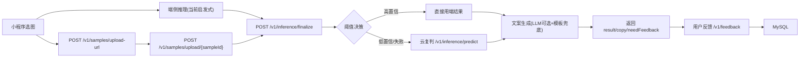

# Meowlator 项目手册（重构版）

> 当前版本：`1.0.0`  
> 仓库路径：`/Users/dysania/program/meowlator`  
> 适用对象：开发者、面试讲解、上线值班人员

---

## 1. 文档目的

这份手册解决三件事：

1. 快速上手：你可以按步骤在本地跑起来。
2. 准确认知：你知道当前能力边界和真实状态，不会误判“已经模型上线”。
3. 可运维：你能做灰度、回滚、排障、成本控制。

---

## 2. 项目一句话

**Meowlator 是一个微信小程序猫意图识别系统：端侧优先推理，低置信度自动云端复判，结果支持搞笑拟人文案与反馈闭环。**

---

## 3. 当前版本边界（必须先看）

1. 当前端推理和云推理主链路仍是**启发式/模拟实现**，不是 ONNX Runtime 真推理。
2. 训练、评估、ONNX 导出脚本已具备，可产出模型文件与指标。
3. 发布工程能力已具备：鉴权、签名、限流、白名单、灰度、回滚。
4. 默认图片保留 7 天，支持删除；风险提示为“非医疗诊断”。

---

## 4. 技术栈与目录

### 4.1 技术栈

1. 小程序：微信原生 + TypeScript
2. API：Go
3. 云推理：Go
4. 训练：Python + PyTorch + torchvision
5. 存储：MySQL
6. 缓存：Redis（文案缓存）
7. 部署：Docker Compose

### 4.2 目录结构

1. `apps/wechat-miniprogram`：小程序
2. `services/api`：业务 API 与编排
3. `services/inference`：云端复判服务
4. `ml/training`：训练与数据流水线
5. `infra/migrations`：数据库迁移
6. `docs`：文档与发布 SOP

---

## 5. 架构与主链路



---

## 6. 快速开始（开发环境）

### 6.1 启动

```bash
make up
```

```bash
docker compose -f infra/docker-compose.yml ps
```

### 6.2 回归

```bash
make test
```

### 6.3 训练与评估（按需）

```bash
make train-vision
make export-onnx
make build-eval-splits
make threshold-report
make evaluate-intent
make gate-model
```

---

## 7. 环境变量（最小必读）

### 7.1 基础运行

1. `API_ADDR`
2. `INFERENCE_URL`
3. `MYSQL_DSN`
4. `REDIS_ADDR`
5. `DEFAULT_RETENTION_DAYS`

### 7.2 推理策略

1. `MODEL_VERSION`
2. `EDGE_ACCEPT_THRESHOLD`
3. `CLOUD_FALLBACK_THRESHOLD`
4. `PAIN_RISK_ENABLED`
5. `EDGE_DEVICE_WHITELIST`

### 7.3 安全与控制

1. `ADMIN_TOKEN`
2. `RATE_LIMIT_PER_USER_MIN`
3. `RATE_LIMIT_PER_IP_MIN`
4. `WHITELIST_ENABLED`
5. `WHITELIST_USERS`
6. `WHITELIST_DAILY_QUOTA`

### 7.4 文案

1. `COPY_LLM_ENABLED`
2. `COPY_LLM_ENDPOINT`
3. `COPY_TIMEOUT_MS`

---

## 8. 业务流程拆解

### 8.1 登录会话

1. 小程序调用 `POST /v1/auth/wechat/login`
2. 得到 `userId + sessionToken + expiresAt`
3. 受保护接口需携带：
   - `Authorization: Bearer <sessionToken>`
   - `X-User-Id: <userId>`

### 8.2 上传与签名

1. `POST /v1/samples/upload-url`
2. 关键接口要求签名：`X-Req-Ts + X-Req-Sig`
3. 当前签名实现：FNV32（MVP 级）
4. 本地上传落盘：`/tmp/meowlator/uploads`

### 8.3 融合推理

阈值决策：

1. `confidence >= edgeAccept`：优先端侧
2. `confidence < cloudFallback`：云端复判 + 强反馈
3. 中间区间：云端复判
4. 端侧失败或设备不支持：云端复判

### 8.4 反馈闭环

1. 用户提交“准/不准”
2. 不准时必须给 `trueLabel`
3. 入库时计算：
   - `training_weight`（确认 0.6，纠错 1.0）
   - `reliability_score`（用户行为可靠度）

---

## 9. 核心知识点（逐条详解）

### 9.1 本地测试 vs 正式部署

定义：

1. 本地测试重“联调速度”。
2. 正式部署重“稳定、可观测、可回滚、合规”。

当前实现差异：

1. 本地可回退内存仓储；线上必须 MySQL 持久化。
2. 本地可用 `127.0.0.1`；线上必须 HTTPS 合法域名。
3. 本地可容忍部分依赖降级；线上必须监控告警齐全。

验证方式：

1. 本地：`make test`
2. 预发：按 `docs/release_sop.md` 灰度演练
3. 线上：观测错误率、p95、fallback 比例

### 9.2 “启发式/模拟，不是 ONNX 真推理”是什么意思

定义：

1. 启发式/模拟：哈希 + 规则 + 先验，不跑神经网络计算。
2. ONNX 真推理：加载 `.onnx`，做真实前处理和张量推理。

当前事实：

1. 训练与 ONNX 导出脚本已存在。
2. 端与云主链路目前是确定性规则推理。
3. 结果可复现，但不代表真实视觉模型能力。

如何判断已经切到真推理：

1. 有 ONNX runtime 会话加载日志。
2. 模型文件不可用时接口会失败。
3. 同图不同模型版本输出有可解释差异。

### 9.3 Redis 和 MySQL 的用处

MySQL：

1. 业务事实存储：用户、样本、反馈、会话、模型注册、风险事件。
2. 支撑审计、回放、训练回收、灰度状态。

Redis：

1. 当前用于文案缓存，降低 LLM 成本与时延。
2. Redis 挂了会降级，不应拖垮主推理链路。

常见误区：

1. Redis 不是业务主存储。
2. 多实例限流不能只靠进程内存。

### 9.4 用户反馈后，训练可以实时吗

结论：

1. 反馈是实时入库。
2. 模型参数更新不是实时在线学习，而是离线/微批训练后发布。

为什么：

1. 实时训练会放大噪声标签风险。
2. 难做可审计与稳定回滚。
3. 对 MVP 成本与复杂度不划算。

建议节奏：

1. 每日增量微批
2. 每周全量重训
3. 每次都走门禁 + 灰度

### 9.5 续训还是重训

规则：

1. `--resume-checkpoint`：续训
2. 不带该参数：重训

为什么两次结果可能不同：

1. 训练清单变化
2. seed/增强随机性
3. 学习率与 epoch 不同

### 9.6 当前结果怎么得到

1. 端侧：`EdgeInferenceEngine`（启发式）
2. 云端：`services/inference`（哈希 + priors 融合）
3. API：按阈值合并并输出统一结构

### 9.7 什么时候才算“模型已上线”

需同时满足：

1. 端/云至少一侧切 ONNX 真推理
2. 固定评估集指标达标
3. 线上稳定指标达标
4. 灰度与回滚演练通过
5. 合规链路（删除/免责声明）可验证

---

## 10. 训练体系说明

### 10.1 标签与任务

意图 8 类：

1. `FEEDING`
2. `SEEK_ATTENTION`
3. `WANT_PLAY`
4. `WANT_DOOR_OPEN`
5. `DEFENSIVE_ALERT`
6. `RELAX_SLEEP`
7. `CURIOUS_OBSERVE`
8. `UNCERTAIN`

### 10.2 当前训练数据来源

1. `oxford`：Oxford-IIIT Pet（伪标签映射）
2. `fake`：FakeData（烟雾测试）
3. 反馈样本：通过清洗与合并脚本进入训练 manifest

### 10.3 训练/验证/测试比例

1. `build_eval_splits.py` 默认 `train=0.7 / val=0.15 / test=0.15`
2. 通过 `seed` 固定切分，保证可复现

### 10.4 关键产物

1. `metrics.json`
2. `intent_priors.json`
3. `confusion_matrix.json`
4. `calibration.json`
5. `gate_report.json`

---

## 11. 发布、灰度、回滚

### 11.1 模型状态

1. `CANDIDATE`
2. `GRAY`
3. `ACTIVE`
4. `ROLLED_BACK`

### 11.2 灰度执行

1. `POST /v1/admin/models/register`
2. `POST /v1/admin/models/rollout`
3. `POST /v1/admin/models/activate`

### 11.3 灰度分流逻辑

1. 服务端按用户稳定分桶（100 桶）
2. 根据 `rolloutRatio + targetBucket` 命中窗口
3. `client-config` 返回 `selectedModel` 与 `inRollout`
4. 小程序把 `selectedModel` 写入端侧 runtime 上报

### 11.4 回滚原则

触发条件（任一命中）：

1. 错误率较基线显著上升
2. p95 延迟显著恶化
3. 投诉异常增加

动作：

1. 激活上个稳定模型
2. 收紧阈值并观察
3. 记录事故窗口与影响范围

---

## 12. 运维与成本

### 12.1 观测重点

1. API 错误率
2. `finalize` p95
3. 云兜底比例
4. LLM 超时率
5. 删除失败率

### 12.2 成本控制抓手

1. 提高端侧命中率，减少云推理调用
2. 提高文案缓存命中率，减少 LLM 成本
3. 原图 7 天清理，长期仅留匿名特征与标签

### 12.3 周报建议字段

1. 云兜底占比
2. 文案缓存命中率
3. 存储增长趋势
4. 单次识别成本估算

---

## 13. 安全与合规

1. 输出边界：娱乐与辅助理解，不作医疗诊断。
2. 风险提示：若启用“疑似不适”，必须附免责声明。
3. 用户权利：支持删除样本与相关记录。
4. 数据策略：默认 7 天过期清理。
5. 发布留痕：模型版本、灰度比例、关键策略变更可追踪。

---

## 14. 开发排障（高频）

### 14.1 小程序 `request` 合法域名错误

1. 本地调试可临时关闭合法域名校验。
2. 线上必须配置 HTTPS 合法域名。

### 14.2 `app.json pages[0]` 找不到文件

1. 检查 `pages` 配置路径是否存在。
2. 检查文件大小写与四件套：`.js/.wxml/.wxss/.json`。

### 14.3 WXML 表达式报语法错

1. 不要在 WXML 里写复杂 JS（例如 `toFixed`）。
2. 在 JS/TS 里预计算后再渲染。

### 14.4 小程序结果和后端不一致

1. 可能触发了云端兜底。
2. 以 `finalize` 返回结果为准，不以单独端侧结果为准。

### 14.5 训练脚本能否后台执行

可以：

```bash
nohup make train-vision > ml/training/logs/train_$(date +%F_%H%M%S).log 2>&1 &
echo $!
```

查看状态：

```bash
ps -ef | rg "scripts/train.py|make train-vision"
tail -f ml/training/logs/<your_log>.log
```

---

## 15. 常用命令速查

```bash
# 启停
make up
make down

# 回归
make test

# 单服务运行
make run-api
make run-inference

# 训练与导出
make train-vision
make train-vision-smoke
make train-vision-resume
make training-daily-pipeline
make export-onnx

# 数据流水线
make clean-feedback-data
make build-training-manifest
make active-learning-daily
make build-eval-splits
make threshold-report
make evaluate-intent
make gate-model
```

自动调度：

1. GitHub Actions 工作流：`.github/workflows/training-daily.yml`
2. 触发方式：
   - 每天 `09:10`（CST）自动运行
   - 手动 `workflow_dispatch` 触发
3. 缺少输入数据时自动跳过，不会把定时任务标记为失败

---

## 16. 上线前检查清单

1. `make test` 全通过
2. 迁移执行完成（`infra/migrations`）
3. `gate_report.json` 通过
4. 白名单/配额配置正确
5. 灰度路径演练通过（10% -> 30% -> 60% -> 100%）
6. 回滚动作已演练
7. 删除链路与过期清理可验证
8. 免责声明覆盖率确认
9. 成本预测在预算内

---

## 17. 知识点覆盖检查（自测）

1. 我能解释本地测试与正式部署差异。
2. 我能解释启发式推理和 ONNX 真推理差异。
3. 我能解释 MySQL 与 Redis 分工。
4. 我能解释反馈实时入库与离线训练发布关系。
5. 我能解释续训与重训触发条件。
6. 我能解释阈值如何决定端云路径。
7. 我能解释灰度分桶与 `selectedModel`。
8. 我能给出一套最小可执行的灰度回滚流程。
